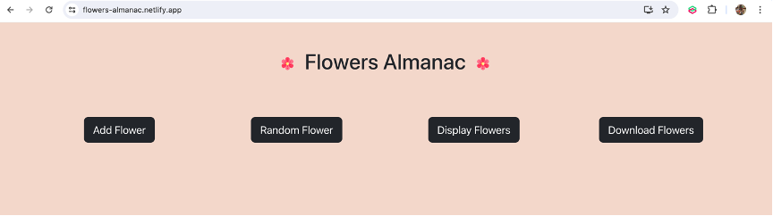
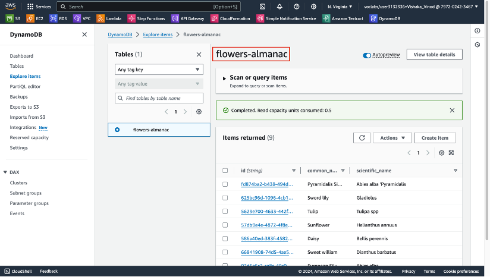
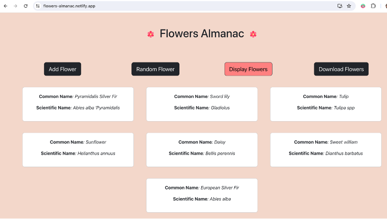
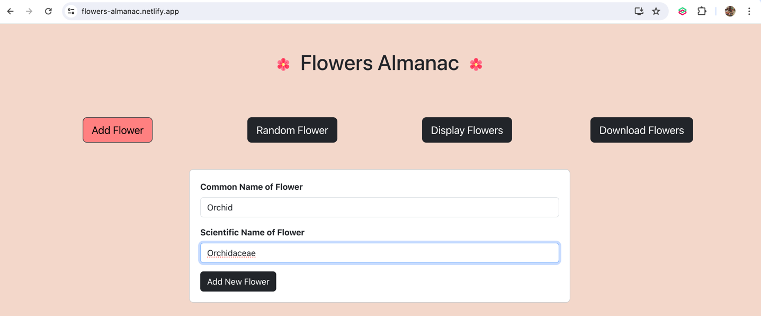
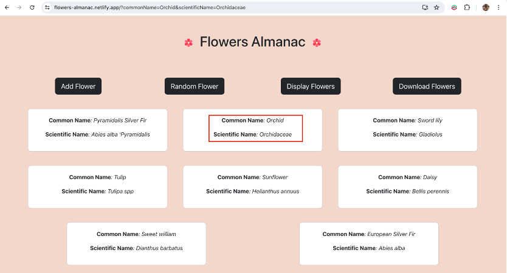
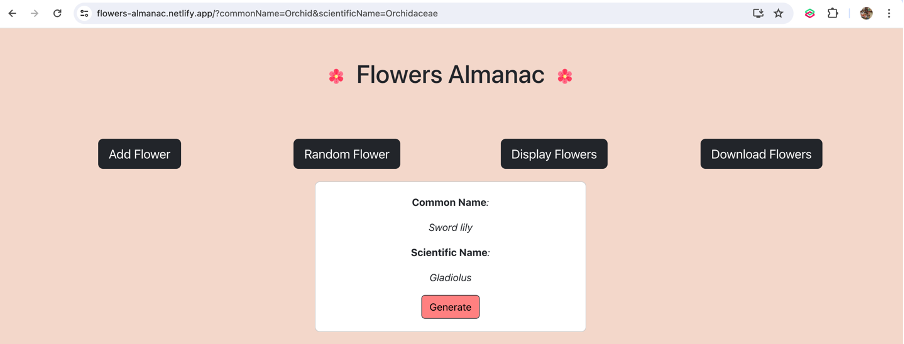
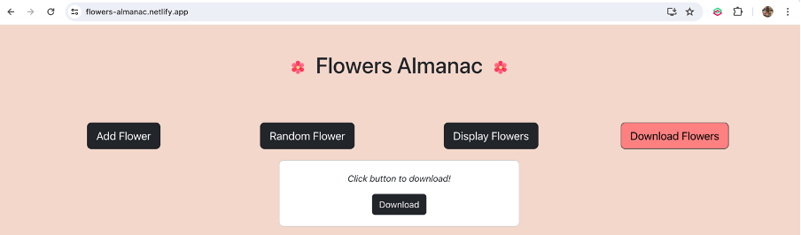
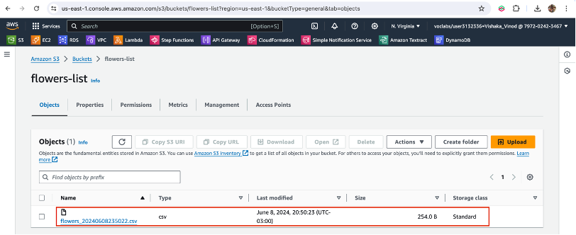
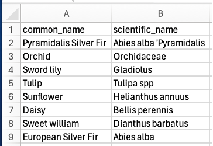

# Flowers Almanac

## Application Overview

**Flowers Almanac** is a simple serverless web application designed for flower enthusiasts to share their knowledge of flowers. Users can view the list of flowers in the database, add new flowers, and generate a random flower. Additionally, they can download a CSV file containing information about all the flowers. The basic frontend is deployed on Netlify and can be accessed [here](https://flowers-almanac.netlify.app).

## Objective

The aim of this application is to create a collaborative platform for flower enthusiasts to:
- Share and expand knowledge of different flower species.
- Provide easy access to flower information.
- Enable users to download comprehensive flower data in CSV format.

## Ideation

The idea for **Flowers Almanac** was to create a simple application that met all the requirements of the sassignment while being challenging enough. The project utilizes several AWS services:
- **AWS Lambda** for serverless functions.
- **S3 buckets** for file storage.
- **DynamoDB** for flower data storage.

I started by building the front end using ReactJS and deployed it on Netlify. The backend consists of four Lambda functions, which handle:
1. Adding a flower to DynamoDB.
2. Generating a random flower.
3. Displaying all flowers.
4. Converting flower data in DynamoDB into a CSV file and uploading it to S3.

API Gateways were used to connect these Lambda functions to the React application. Initial challenges included resolving CORS issues and allowing the React app to access and download CSV files from S3, which were addressed by reading AWS documentation.

## Application Screenshots

### 1. Landing Page

### 2. DynamoDB Database with Flower Data

### 3. Displaying All Flowers

### 4. Adding a New Flower

### 6. Displaying Newly Added Flower

### 7. Random Flower Feature

### 8. Download Flowers Button

### 9. S3 Bucket After Download

### 10. Contents of the Downloaded CSV File

## Future Scope

In the future, the application plans to:
- Include more detailed information about each flower species, such as images, plant family, history, and origins.
- Implement an admin verification process to prevent duplicate or false information from being added to the database.

## References

1. [Netlify](https://www.netlify.com) - Platform for deploying static web applications.
2. [AWS Lambda](https://aws.amazon.com/lambda/) - Serverless compute service.
3. [Amazon S3](https://aws.amazon.com/s3/) - Cloud object storage service.
4. [Amazon DynamoDB](https://aws.amazon.com/dynamodb/) - NoSQL database service.
5. [ReactJS](https://create-react-app.dev) - Frontend JavaScript framework.
6. [Amazon API Gateway](https://aws.amazon.com/api-gateway/) - Service for creating APIs.
7. [AWS S3 Permissions Documentation](https://docs.aws.amazon.com/AmazonS3/latest/userguide/WebsiteAccessPermissionsReqd.html) - Setting permissions for website access.
